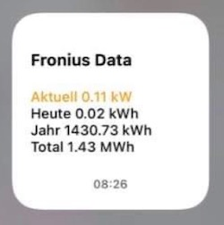

#### scriptable.Fronius V1.02


# Fronius-Widget
Widget für den Fronius-Wechselrichter

Download: >>> [hier](FroniusV1.02.js)

## Kurzbeschreibung
Das Widget für den Fronius-Wechselrichter liest ausgewählte Betriebsdaten über die API-Schnittstelle des Wechselrichters aus und stellt diese in einer Übersicht zur Verfügung. Das Script läuft mit Unterstützung der **App Scriptable** auf dem iPhone ab **iOS14**.

- **Aktuell** in kW, aktuelle Erzeugung einer PV-Anlage
- **Heute** in kWh, Erzeugung der PV-Anlage an diesem Tag (Tagessumme)
- **Jahr** in MWh, Erzeugung der PV-Anlage an diesem Jahr (Jahressumme)
- **Total** in MWh, Erzeugung der PV-Anlage seit der Inbetriebnahme (Totalsumme, Lebenszeit-Summe)

Zur Beachtung: Die Betriebsdaten des Wechselrichter werden nur angezeigt, wenn sich das iPhone im Empfangsbereich des WLAN befindet.

## Settings, Parameter
Im Script (obere Zeile) ist für den Zugriif auf den Fronius-Wechselrichter der folgende Parameter einzugeben:

- **APIurl:** - IP-Adresse des Fronius-Wechselrichters in der Form "xxx.xxx.xxx.xx"

## API-Schnittstelle

````APIurl = "http://xxx.xxx.xxx.xx/solar_api/v1/GetPowerFlowRealtimeData.fcgi"````

Die ausgelesenen Daten werden zur Anzeige gebracht, eine Speicherung der Daten durch das Widget, bspw. in einer Datenbank für die Visualisierung von Trends, erfolgt nicht.

Die folgenden JSON-Daten der Batterie werden verarbeitet:

##### JSON

````
{
  "overview":{
       "lastUpdateTime":"2013-10-01 02:37:47", 
       "lifeTimeData": {
            "energy":761985.75,
            "revenue":946.13104 
        },
        "lastYearData":{ 
            "energy":761985.8, 
            "revenue":0.0
        },
        "lastMonthData":{
            "energy":492736.7,
            "revenue":0.0
        },
        "lastDayData":{
            "energy":0.0,
            "revenue":0.0 
        },
        "currentPower":{
            "power":0.0
        }
}
````
## Changelog

2020/11/12: Fronius V1.02 (Widget) init
